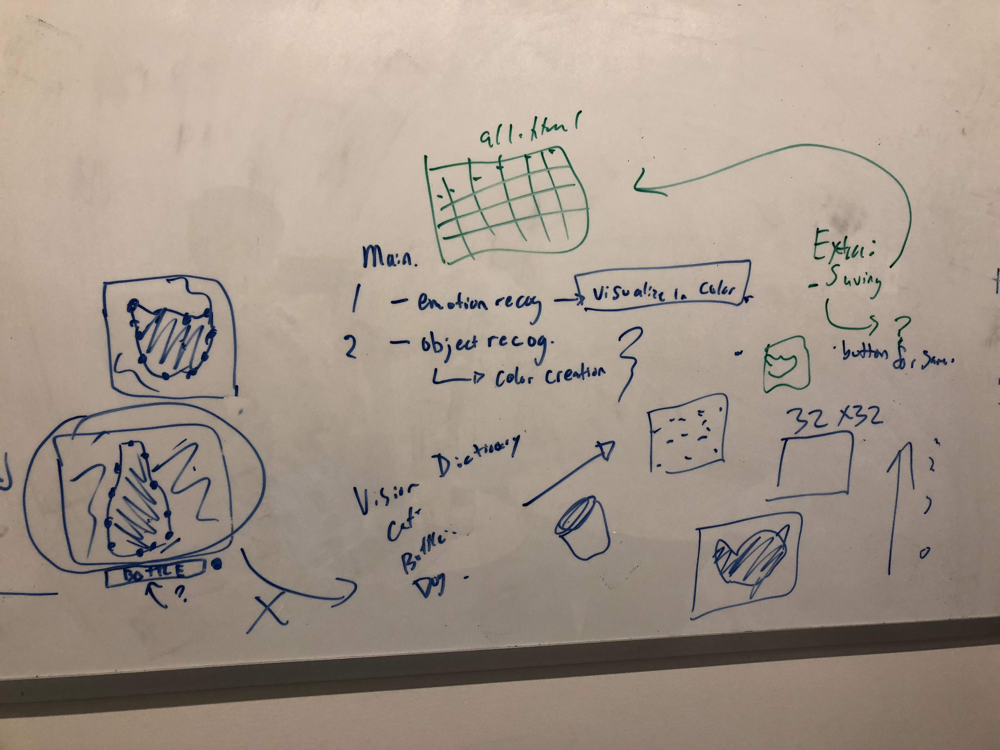

# Fun Lights

**Project Idea**

We are using an LED panel connected to a webcam to visualize information through color.

Features may include:
* Live conversion of webcam image to 32x32 LED display
* Recognize emotion of person's face and visualize on LED panel using color
* Object recognition: use computer vision to recognize object and display cartoon version on LED panel
* Image capture: allow user to press button and save 32x32 image to a web page
* LCD panel displaying text that describes the image below the LED panel

**Team**

Devon Bain (dwb264) 
Christopher Caulfield (ctc98)

**Rough Form**

Paper prototype:

Whiteboard sketches:

**Expected Parts**

* 32x32 LED Panel
* LED Panel Shield
* Raspberry Pi
* Arduino
* Webcam
* LCD panel
* Button (maybe)

**Interaction Plan**

The webcam will be attached to a wall at face height. The user can stand in front of it or hold an object in front of it. The LED panel will automatically change based on the camera image. There will be a button the user can press to save the image. The LCD will display a URL the user can visit to see their 32x32 image.

# Project Check-In - November 8

**Interaction Diagram**

**Interactive Device**

**Learning Experience**

**Completed Work**

**Next Steps**

