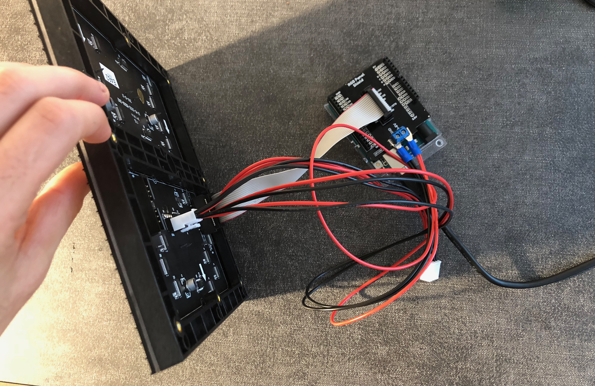

# Fun Lights

**Project Idea**

We are using an LED panel connected to a webcam to visualize information through color.

Features may include:
* Live conversion of webcam image to 32x32 LED display
* Recognize emotion of person's face and visualize on LED panel using color
* Object recognition: use computer vision to recognize object and display cartoon version on LED panel
* Image capture: allow user to press button and save 32x32 image to a web page
* LCD panel displaying text that describes the image below the LED panel

**Who Is This Device For?**
This device can be used as entertainment! It can be placed on the wall in a lobby and users can walk up to it, express an emotion infront of the camera. This emotion will then be translated and visualized on the LED 32x32 panel.

**Team**

Devon Bain (dwb264) 
Christopher Caulfield (ctc98)

**Rough Form**

Paper prototype:

Whiteboard sketches:

**Expected Parts**

* 32x32 LED Panel
* LED Panel Shield
* Raspberry Pi
* Arduino
* Webcam
* LCD panel
* Button (maybe)

**Interaction Plan**

The webcam will be attached to a wall at face height. The user can stand in front of it or hold an object in front of it. The LED panel will automatically change based on the camera image. There will be a button the user can press to save the image. The LCD will display a URL the user can visit to see their 32x32 image.

# Project Check-In - November 8

**Interaction Diagram**

**Interactive Device**

**Learning Experience**

*Panel shield soldering*

To make our lives easier, we bought a panel shield accessory that allows us to directly plug the LED panel into the Arduino. It required soldering about 30-40 different connections, and one piece was soldered backwards. It had to be de-soldered and flipped around in order to connect the panel correctly.

*Magic smoke*

When we first tried to power up the panel and Arduino, we mistakenly used a 9V adapter instead of the recommended 3-5V. This, possibly in combination with the backwards component, caused the panel to start smoking. The panel was partially burnt out as a result, and we have ordered another from SparkFun that should arrive next week.

**Completed Work**

* Wrote code to obtain small images from image search API
* Figured out correct setup for connecting LED panel and Arduino
* Wrote script to download images from an array of urls and resize to 32x32

**Next Steps**

* Combine image search, Google Vision and image-resizing scripts to resize images retrieved from the API
* Convert 32x32 image into an array of RGB values which can be sent to the LED panel
* Incorporate webcam and button into device to use webcam as source for the initial photo
* Incoporate LCD panel into device to display instructions/feedback to the user

# Final project deliverable - November 8

**Hardware Constraints**
After completing the backend logic of converting an image onto a 32x32 LED display. We discovered displaying the image was much harder than expected! First the Arduino Uno has a limited amound of SRAM (2k bytes). The 32x32 LED takes up 1.6k bytes leaving .4 remaining for all other SRAM processing. This makes it difficult to manage the different communications going in and out of the Ardunio such as the LED and Serial reader/writer. Secondly, the most popular LED display library on Github provided limited documentation about how to display a custom 32x32 image on the LED display. Finally, writing color pixels to the serial was also difficult, we were only successful at reading in single 'Chars'. Initially we wanted to display strings of RGB values for each pixel.

Because of these issues with the LED display, SRAM, and Searial reader we focused on how to display information on the LED given a single Char value. Displaying a image on the LED was no longer feasible, but display emotion was. We decided to build out this functionality and enhance it as our final project.

**Interaction Diagram - revised**
Image here

**Final Code**
All final project code can be viewed in the Master branch. 

**Final Video**
Final video can be found here: https://www.youtube.com/watch?v=Z7KM9nJAe3Y
